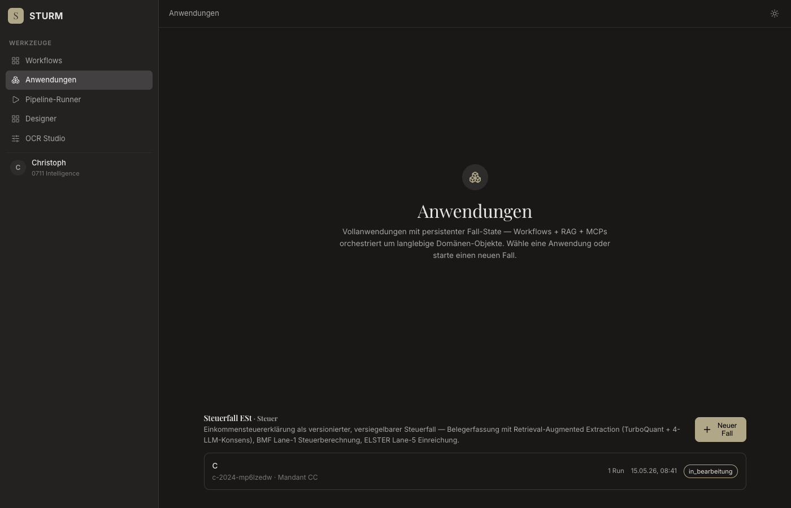
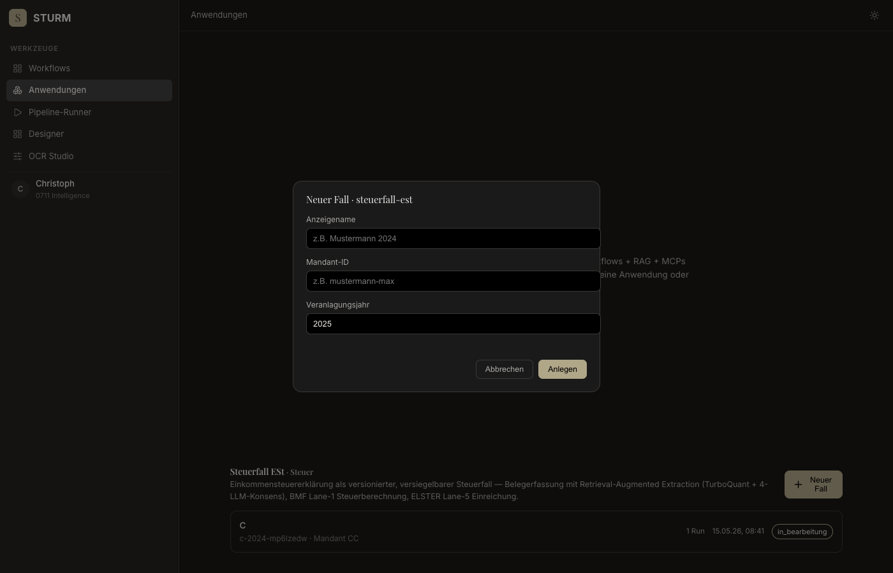
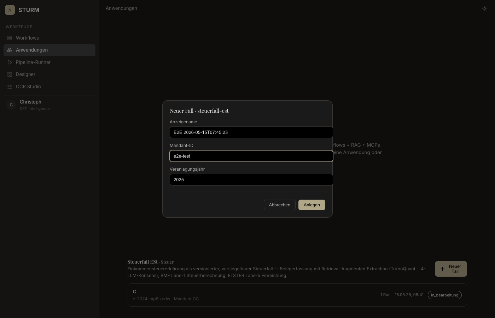
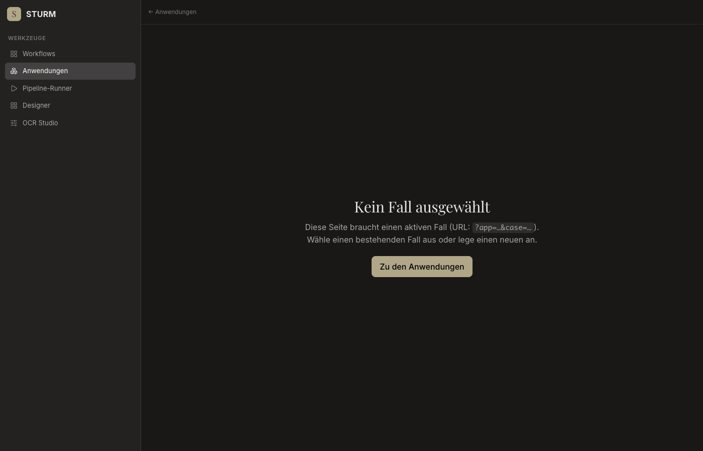

# E2E Anwendungen — Fehlerreport

**Datum:** 2026-05-15T07:45:17.600Z
**Target:** https://sturm.0711.io
**Fixture:** VAST_Belege_Stricker.pdf
**Case-ID:** e2e-2026-05-15t07-45-23-2025-mp6m4fxl

## Zusammenfassung

- ✅ OK:   **3**
- ❌ Fail: **5**
- ⏭ Skip: **0**

| # | Schritt | Status | Fehler |
|---|---|---|---|
| 1 | open-anwendungen | ✅ ok |  |
| 2 | open-new-case-modal | ✅ ok |  |
| 3 | create-case | ✅ ok |  |
| 4 | steuerfall-loaded | ❌ fail | Error: failed to find element matching selector "#case-display" |
| 5 | upload-and-extract | ❌ fail | #file input missing |
| 6 | verify-canonical-layer | ❌ fail | layer-rows tbody empty |
| 7 | seal | ❌ fail | #btn-seal not found |
| 8 | export | ❌ fail | #btn-export not found |

---

## ✅ Step 1: open-anwendungen
*GET /anwendungen.html*

- **Status:** ok
- **Started:** 2026-05-15T07:45:22.475Z
- **Finished:** 2026-05-15T07:45:23.844Z

### Screenshots

**loaded**



### Log

```
[07:45:23] screenshot → step-01-loaded.png
[07:45:23] App-Sections gerendert: 1
```

---

## ✅ Step 2: open-new-case-modal
*Click "Neuer Fall" button*

- **Status:** ok
- **Started:** 2026-05-15T07:45:23.844Z
- **Finished:** 2026-05-15T07:45:23.899Z

### Screenshots

**modal-open**



### Log

```
[07:45:23] screenshot → step-02-modal-open.png
```

---

## ✅ Step 3: create-case
*Fill modal + submit POST /api/applications/.../instances*

- **Status:** ok
- **Started:** 2026-05-15T07:45:23.899Z
- **Finished:** 2026-05-15T07:45:24.734Z

### Screenshots

**filled**



### Log

```
[07:45:24] screenshot → step-03-filled.png
[07:45:24] POST instances → 201  {"caseId":"e2e-2026-05-15t07-45-23-2025-mp6m4fxl","appId":"steuerfall-est","displayName":"E2E 2026-05-15T07:45:23","mandantId":"e2e-test","veranlagungsjahr":2025,"status":"in_bearbeitung","createdAt":"2026-05-15T07:45:24.393Z","updatedAt":"2026-05-15T07:45:24.394Z","runs":[],"workspacePath":"applications/steuerfall-est/e2e-2026-05-15t07-45-23-2025-mp6m4fxl"}
[07:45:24] redirected → https://sturm.0711.io/steuerfall.html?app=null&case=e2e-2026-05-15t07-45-23-2025-mp6m4fxl
```

---

## ❌ Step 4: steuerfall-loaded
*Verify /steuerfall.html rendered with case data*

- **Status:** fail
- **Started:** 2026-05-15T07:45:24.734Z
- **Finished:** 2026-05-15T07:45:34.913Z
- **Fehler:** `Error: failed to find element matching selector "#case-display"`

### Screenshots

**loaded**


**failure**


### Log

```
[07:45:34] screenshot → step-04-loaded.png
[07:45:34] screenshot → step-04-failure.png
```

---

## ❌ Step 5: upload-and-extract
*Upload VAST_Belege_Stricker.pdf → SSE*

- **Status:** fail
- **Started:** 2026-05-15T07:45:34.913Z
- **Finished:** 2026-05-15T07:45:34.933Z
- **Fehler:** `#file input missing`

### Screenshots

**failure**


### Log

```
[07:45:34] screenshot → step-05-failure.png
```

---

## ❌ Step 6: verify-canonical-layer
*Result table rendered with ≥1 row*

- **Status:** fail
- **Started:** 2026-05-15T07:45:34.933Z
- **Finished:** 2026-05-15T07:45:50.192Z
- **Fehler:** `layer-rows tbody empty`

### Screenshots

**layer**


**failure**



### Log

```
[07:45:50] screenshot → step-06-layer.png
[07:45:50] screenshot → step-06-failure.png
```

---

## ❌ Step 7: seal
*Click "Versiegeln" → steuerfall-seal workflow*

- **Status:** fail
- **Started:** 2026-05-15T07:45:50.192Z
- **Finished:** 2026-05-15T07:45:50.217Z
- **Fehler:** `#btn-seal not found`

### Screenshots

**failure**


### Log

```
[07:45:50] screenshot → step-07-failure.png
```

---

## ❌ Step 8: export
*Click "An ELSTER" → Lane-5 MCP (Stub erwartet)*

- **Status:** fail
- **Started:** 2026-05-15T07:45:50.217Z
- **Finished:** 2026-05-15T07:45:50.242Z
- **Fehler:** `#btn-export not found`

### Screenshots

**failure**


### Log

```
[07:45:50] screenshot → step-08-failure.png
```

## Console (errors + warnings)

```
[07:45:24] PAGEERROR missing or invalid app/case params
```