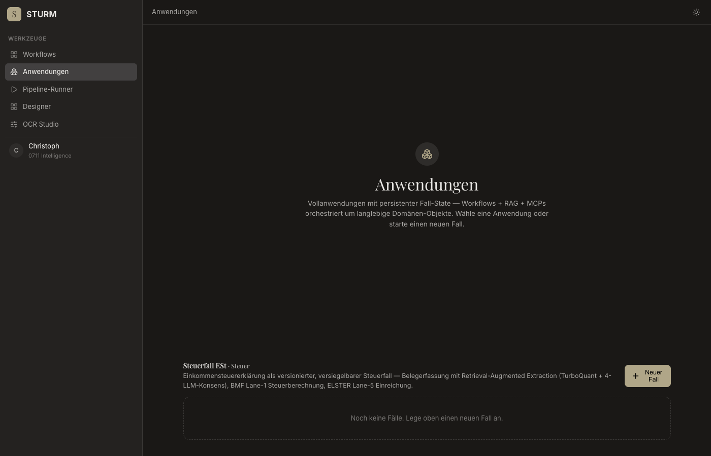
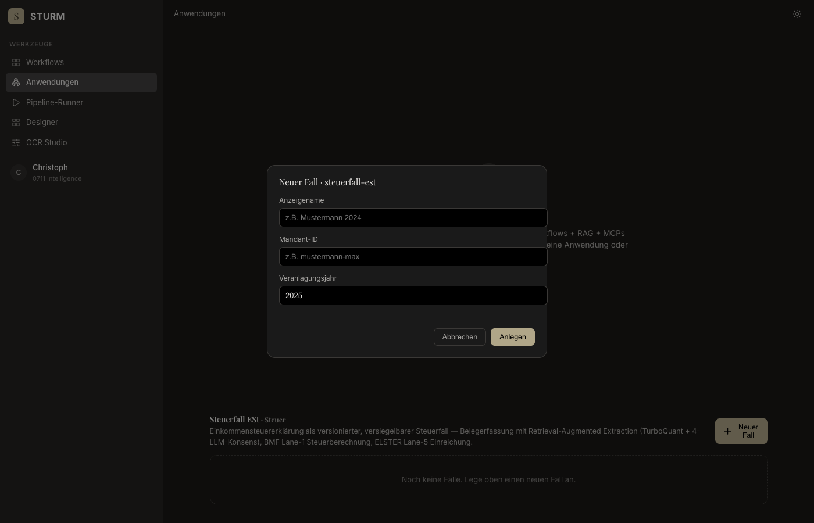
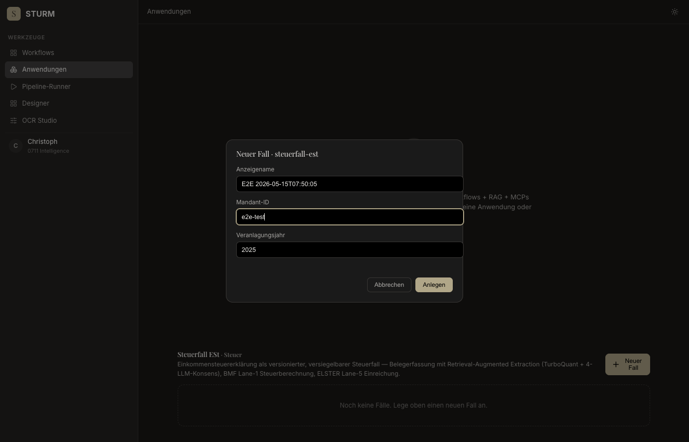
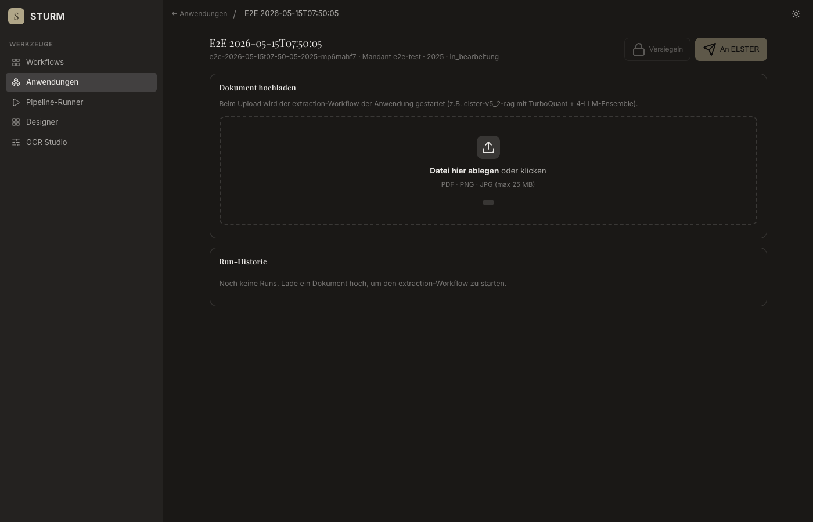
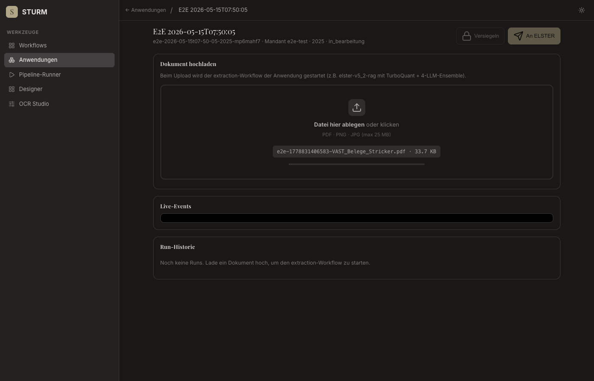
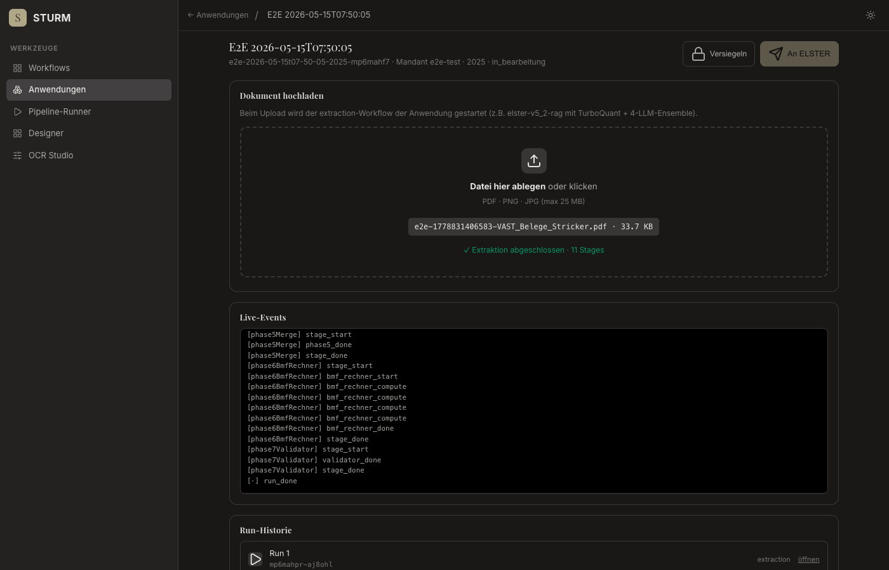
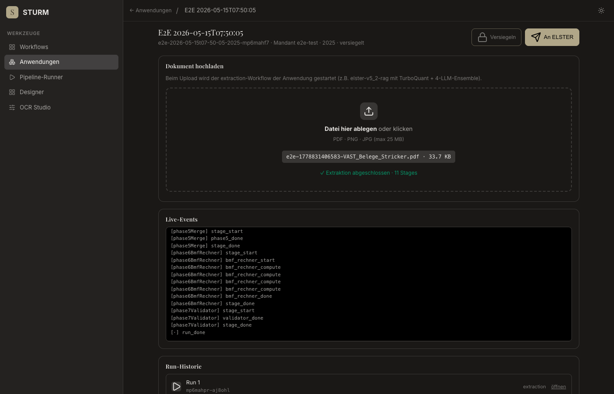

# E2E Anwendungen — Fehlerreport

**Datum:** 2026-05-15T07:50:04.118Z
**Target:** https://sturm.0711.io
**Fixture:** VAST_Belege_Stricker.pdf
**Case-ID:** e2e-2026-05-15t07-50-05-2025-mp6mahf7

## Zusammenfassung

- ✅ OK:   **8**
- ❌ Fail: **0**
- ⏭ Skip: **0**

| # | Schritt | Status | Fehler |
|---|---|---|---|
| 1 | open-anwendungen | ✅ ok |  |
| 2 | open-new-case-modal | ✅ ok |  |
| 3 | create-case | ✅ ok |  |
| 4 | steuerfall-loaded | ✅ ok |  |
| 5 | upload-and-extract | ✅ ok |  |
| 6 | verify-canonical-layer | ✅ ok |  |
| 7 | seal | ✅ ok |  |
| 8 | export | ✅ ok |  |

---

## ✅ Step 1: open-anwendungen
*GET /anwendungen.html*

- **Status:** ok
- **Started:** 2026-05-15T07:50:04.538Z
- **Finished:** 2026-05-15T07:50:05.726Z

### Screenshots

**loaded**



### Log

```
[07:50:05] screenshot → step-01-loaded.png
[07:50:05] App-Sections gerendert: 1
```

---

## ✅ Step 2: open-new-case-modal
*Click "Neuer Fall" button*

- **Status:** ok
- **Started:** 2026-05-15T07:50:05.726Z
- **Finished:** 2026-05-15T07:50:05.784Z

### Screenshots

**modal-open**



### Log

```
[07:50:05] screenshot → step-02-modal-open.png
```

---

## ✅ Step 3: create-case
*Fill modal + submit POST /api/applications/.../instances*

- **Status:** ok
- **Started:** 2026-05-15T07:50:05.784Z
- **Finished:** 2026-05-15T07:50:06.547Z

### Screenshots

**filled**



### Log

```
[07:50:06] screenshot → step-03-filled.png
[07:50:06] POST instances → 201  {"caseId":"e2e-2026-05-15t07-50-05-2025-mp6mahf7","appId":"steuerfall-est","displayName":"E2E 2026-05-15T07:50:05","mandantId":"e2e-test","veranlagungsjahr":2025,"status":"in_bearbeitung","createdAt":"2026-05-15T07:50:06.259Z","updatedAt":"2026-05-15T07:50:06.260Z","runs":[],"workspacePath":"applications/steuerfall-est/e2e-2026-05-15t07-50-05-2025-mp6mahf7"}
[07:50:06] redirected → https://sturm.0711.io/steuerfall.html?app=steuerfall-est&case=e2e-2026-05-15t07-50-05-2025-mp6mahf7
```

---

## ✅ Step 4: steuerfall-loaded
*Verify /steuerfall.html rendered with case data*

- **Status:** ok
- **Started:** 2026-05-15T07:50:06.547Z
- **Finished:** 2026-05-15T07:50:06.582Z

### Screenshots

**loaded**



### Log

```
[07:50:06] screenshot → step-04-loaded.png
[07:50:06] case-display: E2E 2026-05-15T07:50:05
[07:50:06] case-meta:    e2e-2026-05-15t07-50-05-2025-mp6mahf7 · Mandant e2e-test · 2025 · in_bearbeitung
```

---

## ✅ Step 5: upload-and-extract
*Upload VAST_Belege_Stricker.pdf → SSE*

- **Status:** ok
- **Started:** 2026-05-15T07:50:06.583Z
- **Finished:** 2026-05-15T07:50:15.750Z

### Screenshots

**uploading-start**



**after-upload**


### Log

```
[07:50:06] file selected: /tmp/e2e-1778831406583-VAST_Belege_Stricker.pdf
[07:50:06] screenshot → step-05-uploading-start.png
[07:50:15] screenshot → step-05-after-upload.png
[07:50:15] drop-result: ✓ Extraktion abgeschlossen · 11 Stages
[07:50:15] last events:
[phase3LlmFill] stage_done
[phase4Disambig] stage_start
[phase4Disambig] phase4_start
[phase4Disambig] phase4_done
[phase4Disambig] stage_done
[phase5Merge] stage_start
[phase5Merge] phase5_done
[phase5Merge] stage_done
[phase6BmfRechner] stage_start
[phase6BmfRechner] bmf_rechner_start
[phase6BmfRechner] bmf_rechner_compute
[phase6BmfRechner] bmf_rechner_compute
[phase6BmfRechner] bmf_rechner_compute
[phase6BmfRechner] bmf_rechner_compute
[phase6BmfRechner] bmf_rechner_done
[phase6BmfRechner] stage_done
[phase7Validator] stage_start
[phase7Validator] validator_done
[phase7Validator] stage_done
[·] run_done
```

---

## ✅ Step 6: verify-canonical-layer
*Result table rendered with ≥1 row*

- **Status:** ok
- **Started:** 2026-05-15T07:50:15.750Z
- **Finished:** 2026-05-15T07:50:15.820Z

### Screenshots

**layer**



### Log

```
[07:50:15] screenshot → step-06-layer.png
[07:50:15] layer rows: 9
[07:50:15] layer-sub:  aus Stage: phase6BmfRechner · 20 eCodes · REGEX_3F=16 · BMF_RECHNER=4
[07:50:15] GET /result stats  {"totalFields":20,"byOrigin":{"REGEX_3F":16,"BMF_RECHNER":4}}
```

---

## ✅ Step 7: seal
*Click "Versiegeln" → steuerfall-seal workflow*

- **Status:** ok
- **Started:** 2026-05-15T07:50:15.820Z
- **Finished:** 2026-05-15T07:50:18.407Z

### Screenshots

**after-seal**



### Log

```
[07:50:15] btn-seal disabled? false
[07:50:15] POST /seal → 200
[07:50:18] screenshot → step-07-after-seal.png
[07:50:18] alerts captured  ["Fall versiegelt."]
[07:50:18] case-meta after seal: e2e-2026-05-15t07-50-05-2025-mp6mahf7 · Mandant e2e-test · 2025 · versiegelt
```

---

## ✅ Step 8: export
*Click "An ELSTER" → Lane-5 MCP (Stub erwartet)*

- **Status:** ok
- **Started:** 2026-05-15T07:50:18.407Z
- **Finished:** 2026-05-15T07:50:20.005Z

### Screenshots

**after-export**


### Log

```
[07:50:18] btn-export disabled? false
[07:50:18] POST /export → 503  {"erfolg":false,"reason":"mcp-unavailable"}
[07:50:20] screenshot → step-08-after-export.png
```

---

## Netzwerk-Fehler (Status ≥ 400)

```
[07:50:18] POST https://sturm.0711.io/api/applications/steuerfall-est/instances/e2e-2026-05-15t07-50-05-2025-mp6mahf7/export → 503
  body: {"erfolg":false,"reason":"mcp-unavailable"}
```

## Console (errors + warnings)

```
[07:50:18] ERROR Failed to load resource: the server responded with a status of 503 ()
```