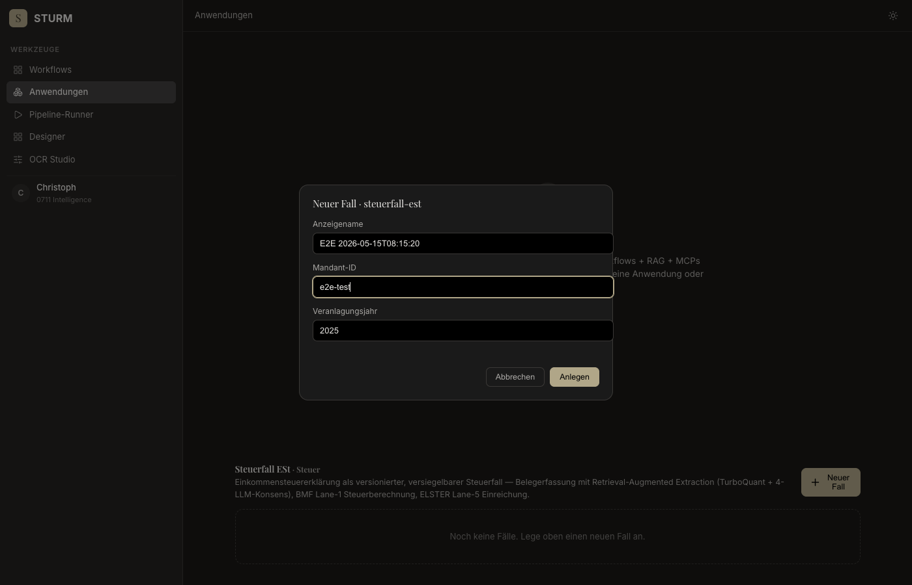
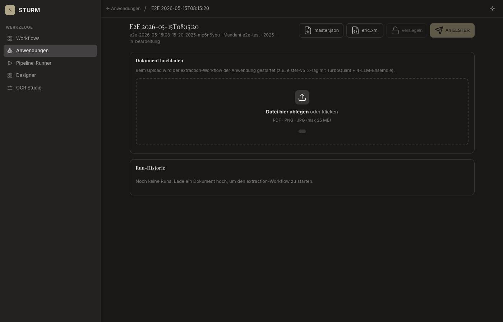
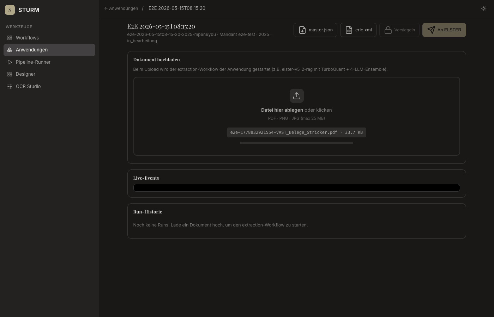
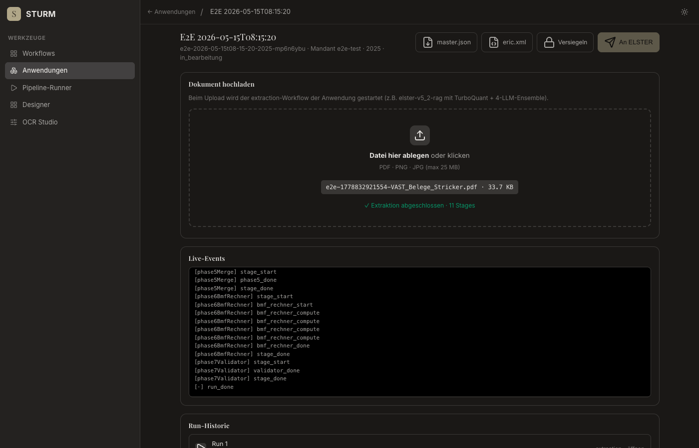
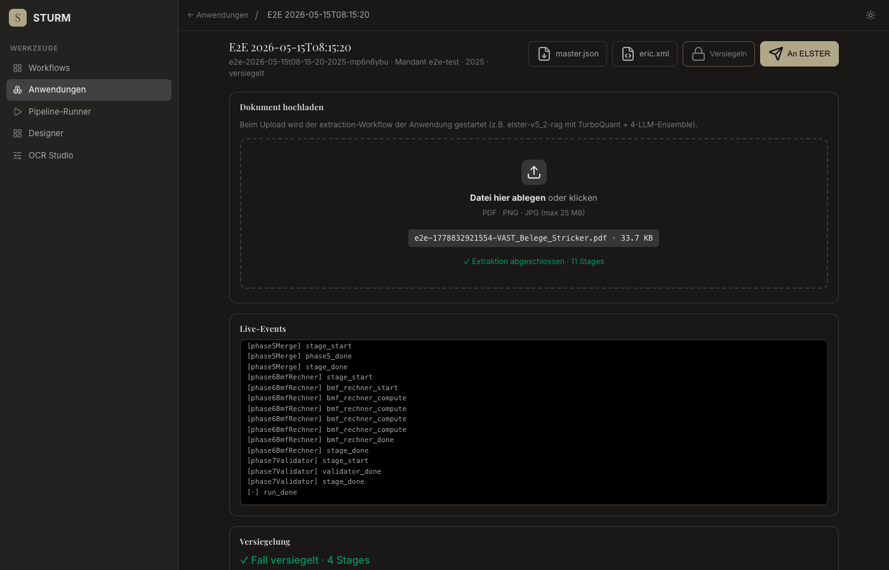

# E2E Anwendungen — Fehlerreport

**Datum:** 2026-05-15T08:15:18.894Z
**Target:** https://sturm.0711.io
**Fixture:** VAST_Belege_Stricker.pdf
**Case-ID:** (nicht erstellt)

## Zusammenfassung

- ✅ OK:   **7**
- ❌ Fail: **1**
- ⏭ Skip: **0**

| # | Schritt | Status | Fehler |
|---|---|---|---|
| 1 | open-anwendungen | ✅ ok |  |
| 2 | open-new-case-modal | ✅ ok |  |
| 3 | create-case | ❌ fail | caseId not in response |
| 4 | steuerfall-loaded | ✅ ok |  |
| 5 | upload-and-extract | ✅ ok |  |
| 6 | verify-canonical-layer | ✅ ok |  |
| 7 | seal | ✅ ok |  |
| 8 | export | ✅ ok |  |

---

## ✅ Step 1: open-anwendungen
*GET /anwendungen.html*

- **Status:** ok
- **Started:** 2026-05-15T08:15:19.331Z
- **Finished:** 2026-05-15T08:15:20.616Z

### Screenshots

**loaded**


### Log

```
[08:15:20] screenshot → step-01-loaded.png
[08:15:20] App-Sections gerendert: 1
```

---

## ✅ Step 2: open-new-case-modal
*Click "Neuer Fall" button*

- **Status:** ok
- **Started:** 2026-05-15T08:15:20.616Z
- **Finished:** 2026-05-15T08:15:20.674Z

### Screenshots

**modal-open**


### Log

```
[08:15:20] screenshot → step-02-modal-open.png
```

---

## ❌ Step 3: create-case
*Fill modal + submit POST /api/applications/.../instances*

- **Status:** fail
- **Started:** 2026-05-15T08:15:20.674Z
- **Finished:** 2026-05-15T08:15:21.261Z
- **Fehler:** `caseId not in response`

### Screenshots

**filled**



### Log

```
[08:15:21] screenshot → step-03-filled.png
[08:15:21] POST instances → 201  null
[08:15:21] screenshot failed: Protocol error (Page.captureScreenshot): Cannot take screenshot with 0 width.
```

---

## ✅ Step 4: steuerfall-loaded
*Verify /steuerfall.html rendered with case data*

- **Status:** ok
- **Started:** 2026-05-15T08:15:21.261Z
- **Finished:** 2026-05-15T08:15:21.554Z

### Screenshots

**loaded**



### Log

```
[08:15:21] screenshot → step-04-loaded.png
[08:15:21] case-display: E2E 2026-05-15T08:15:20
[08:15:21] case-meta:    e2e-2026-05-15t08-15-20-2025-mp6n6ybu · Mandant e2e-test · 2025 · in_bearbeitung
```

---

## ✅ Step 5: upload-and-extract
*Upload VAST_Belege_Stricker.pdf → SSE*

- **Status:** ok
- **Started:** 2026-05-15T08:15:21.554Z
- **Finished:** 2026-05-15T08:15:32.710Z

### Screenshots

**uploading-start**



**after-upload**


### Log

```
[08:15:21] file selected: /tmp/e2e-1778832921554-VAST_Belege_Stricker.pdf
[08:15:21] screenshot → step-05-uploading-start.png
[08:15:32] screenshot → step-05-after-upload.png
[08:15:32] drop-result: ✓ Extraktion abgeschlossen · 11 Stages
[08:15:32] last events:
[phase3LlmFill] stage_done
[phase4Disambig] stage_start
[phase4Disambig] phase4_start
[phase4Disambig] phase4_done
[phase4Disambig] stage_done
[phase5Merge] stage_start
[phase5Merge] phase5_done
[phase5Merge] stage_done
[phase6BmfRechner] stage_start
[phase6BmfRechner] bmf_rechner_start
[phase6BmfRechner] bmf_rechner_compute
[phase6BmfRechner] bmf_rechner_compute
[phase6BmfRechner] bmf_rechner_compute
[phase6BmfRechner] bmf_rechner_compute
[phase6BmfRechner] bmf_rechner_done
[phase6BmfRechner] stage_done
[phase7Validator] stage_start
[phase7Validator] validator_done
[phase7Validator] stage_done
[·] run_done
```

---

## ✅ Step 6: verify-canonical-layer
*Result table rendered with ≥1 row*

- **Status:** ok
- **Started:** 2026-05-15T08:15:32.710Z
- **Finished:** 2026-05-15T08:15:32.776Z

### Screenshots

**layer**



### Log

```
[08:15:32] screenshot → step-06-layer.png
[08:15:32] layer rows: 9
[08:15:32] layer-sub:  aus Stage: phase6BmfRechner · 20 eCodes · REGEX_3F=16 · BMF_RECHNER=4
[08:15:32] GET /result stats
```

---

## ✅ Step 7: seal
*Click "Versiegeln" → steuerfall-seal workflow*

- **Status:** ok
- **Started:** 2026-05-15T08:15:32.776Z
- **Finished:** 2026-05-15T08:15:35.368Z

### Screenshots

**after-seal**



### Log

```
[08:15:32] btn-seal disabled? false
[08:15:32] POST /seal → 200
[08:15:35] screenshot → step-07-after-seal.png
[08:15:35] alerts captured  []
[08:15:35] case-meta after seal: e2e-2026-05-15t08-15-20-2025-mp6n6ybu · Mandant e2e-test · 2025 · versiegelt
```

---

## ✅ Step 8: export
*Click "An ELSTER" → Lane-5 MCP (Stub erwartet)*

- **Status:** ok
- **Started:** 2026-05-15T08:15:35.368Z
- **Finished:** 2026-05-15T08:15:36.966Z

### Screenshots

**after-export**


### Log

```
[08:15:35] btn-export disabled? false
[08:15:35] POST /export → 503  {"erfolg":false,"reason":"mcp-unavailable"}
[08:15:36] screenshot → step-08-after-export.png
```

---

## Netzwerk-Fehler (Status ≥ 400)

```
[08:15:32] GET https://sturm.0711.io/api/applications/steuerfall-est/instances/undefined/result → 404
  body: {"error":"case not found: undefined"}
[08:15:35] POST https://sturm.0711.io/api/applications/steuerfall-est/instances/e2e-2026-05-15t08-15-20-2025-mp6n6ybu/export → 503
  body: {"erfolg":false,"reason":"mcp-unavailable"}
```

## Console (errors + warnings)

```
[08:15:32] ERROR Failed to load resource: the server responded with a status of 404 ()
[08:15:35] ERROR Failed to load resource: the server responded with a status of 503 ()
```