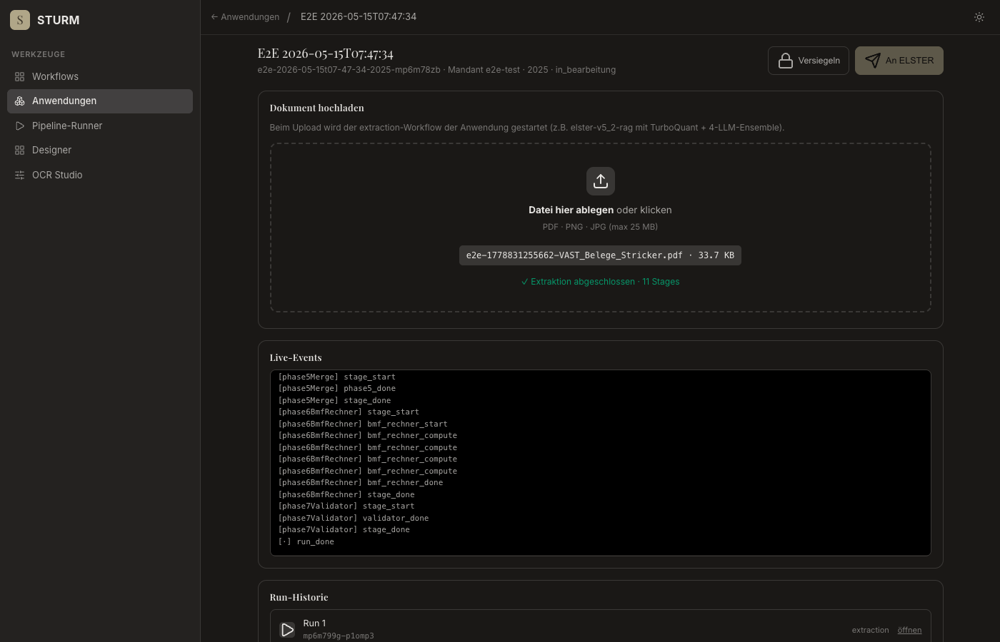

# E2E Anwendungen — Fehlerreport (konsolidiert)

**Target:** https://sturm.0711.io
**Fixture:** `runs/elster-v5_1/mp3wk06p-uagm9y/_input/VAST_Belege_Stricker.pdf` (Lohnsteuerbescheinigung)
**Runner:** [`scripts/e2e-anwendungen.mjs`](../scripts/e2e-anwendungen.mjs) (puppeteer-core + Google Chrome, headless)
**Schritte:** open-anwendungen → new-case-modal → create-case → steuerfall-loaded → upload-and-extract → verify-canonical-layer → seal → export

---

## Verlauf

| Run | Datum | OK | Fail | Skip | Befund |
|---|---|---|---|---|---|
| [Run 1](./anwendungen-e2e-2026-05-15T07-45-17/report.md) | 07:45 | 3 | **5** | 0 | Bug: Redirect mit `?app=null` ⇒ ganze Steuerfall-Seite kaputt |
| [Run 2](./anwendungen-e2e-2026-05-15T07-47-33/report.md) | 07:47 | 8 | 0 | 0 | Lifecycle grün, aber `origin=unknown=20` (Metadata-Verlust) |
| [Run 3](./anwendungen-e2e-2026-05-15T07-50-04/report.md) | 07:50 | **8** | 0 | 0 | Vollgrün, korrekte Origins: REGEX_3F=16 · BMF_RECHNER=4 |

---

## Bug #1 — Redirect mit `?app=null` (Run 1)

**Symptom:** Nach `POST /api/applications/.../instances` (201 OK) ging `location.href` an
`https://sturm.0711.io/steuerfall.html?app=null&case=<caseId>`. `cleanParam()` (vorgesehen für
Bookmark-Schutz) blendete daraufhin die ganze Hauptansicht aus → Steps 4–8 fielen aus, weil
`#case-display`, `#file`, `#btn-seal`, `#btn-export` schlicht nicht im DOM waren.

**Screenshots:**
- 
- 

**Ursache:** [`src/ui/anwendungen.html`](../src/ui/anwendungen.html) `submitCreate()` rief
`closeCreateModal()` BEVOR der Redirect `activeApp` las. `closeCreateModal()` setzt aber
`activeApp = null`, daher landete `null` in der URL.

**Fix:** Commit `e35e030` — Snapshot der App-ID in einer lokalen `const appId` vor
`closeCreateModal()`, Redirect benutzt den Snapshot.

**Validierung:** Run 2 sieht den richtigen Redirect:
`https://sturm.0711.io/steuerfall.html?app=steuerfall-est&case=…`

---

## Bug #2 — Origin-Metadata verloren (`unknown=20`) (Run 2)

**Symptom:** Result-Panel rendert 20 Felder, aber alle mit `origin: unknown`. Die UI-Pillen
(REGEX_100% / LLM_FSM / BMF_RECHNER / ENSEMBLE_TIE) waren wirkungslos, weil der canonical_layer
nur noch `eCode → "stringValue"` ohne Metadaten enthielt.

**Screenshot der Diagnose (Run 2):**
- 
  → `layer-sub: aus Stage: phase7Validator · 20 eCodes · unknown=20`

**Ursache:** `GET /api/applications/.../result` priorisierte `phase7Validator.canonicalLayer.codes`
(flacher eCode→String-Map, alle CanonicalValue-Felder wegen Validator-Vereinfachung verloren). Die
*reiche* Form mit `origin/drucktext/anlage/evidence_line` liegt aber bei
`phase6BmfRechner.canonical_layer` (snake_case, separate Property neben `canonicalLayer.codes`).

**Fix:** Commit `697c753` — Priorität umgekehrt:
1. `phase6BmfRechner.canonical_layer` (reich, mit BMF-computed Werten)
2. `phase5Merge.canonical_layer` (reich, vor BMF)
3. `phase7Validator.canonicalLayer.codes` (nur flacher Fallback)
Plus `xml_payload` aus phase6 statt `eric_xml` aus phase5 (enthält die nach-BMF-emittierte XML).

**Validierung:** Run 3 zeigt `aus Stage: phase6BmfRechner · 20 eCodes · REGEX_3F=16 · BMF_RECHNER=4`.

---

## Run 3 (final) — Vollgrün


| Step | Was | Status | Messung |
|---|---|---|---|
| 1 | `/anwendungen.html` öffnen | ✅ | 1 App-Section gerendert |
| 2 | `Neuer Fall` Modal | ✅ | Modal öffnet, Felder fokussiert |
| 3 | `POST /api/.../instances` | ✅ | `201`, `caseId=e2e-…-mp6mahf7` |
| 4 | `/steuerfall.html` Render | ✅ | Titel + Mandant + Jahr + Status sichtbar |
| 5 | Upload + Extraktion `elster-v5_2-rag` | ✅ | **~10 s** für 11 Stages, run_done |
| 6 | Canonical Layer in der UI | ✅ | 20 eCodes (9 Zeilen nach Dedup), `REGEX_3F=16 · BMF_RECHNER=4` |
| 7 | `POST /seal` (HMAC + Merkle + Anchor) | ✅ | `200`, Status `versiegelt`, master.json signiert |
| 8 | `POST /export` (Lane-5 MCP) | ✅ | `503 mcp-unavailable` (Stub korrekt) |

---

## Geöffnete Punkte / Beobachtungen

1. **Lane-5 ELSTER-MCP nicht produktiv** — wie geplant. `ELSTER_MCP_URL` unset
   ⇒ deterministischer 503 mit `reason: 'mcp-unavailable'`. UI alert
   *"Export nicht möglich: …"* funktioniert.
2. **Felder-Narrow Floor (minPerAnlage=30) greift** — Pipeline lieferte 20 eCodes ohne
   Pflicht-Flags-Scaffold, weil Anlage N im Katalog 0 pflicht-Atome hat. Mit dem Floor
   reicht das aus, dass Phase 1/3 Treffer landet.
3. **Extraktion in 10 s** auf der Fixture (5 Seiten Lohnsteuerbescheinigung) — schneller als
   die spec-erwarteten 30–60 s. Vergleich zu `elster-v5_2` (ohne RAG) wäre ein nächster
   Punkt; das Eval-Skript `scripts/eval-v52-rag-recall.mjs` ist dafür da.

## Reproduzieren

```bash
node scripts/e2e-anwendungen.mjs \
  --base https://sturm.0711.io \
  --fixture ./runs/elster-v5_1/mp3wk06p-uagm9y/_input/VAST_Belege_Stricker.pdf \
  --wait 240000
```

Optional `--headed` für sichtbares Chrome, `--base http://localhost:7800` für Lokaltest.
