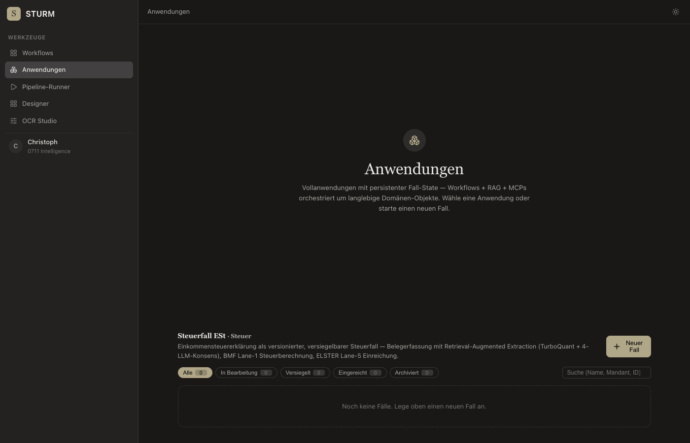
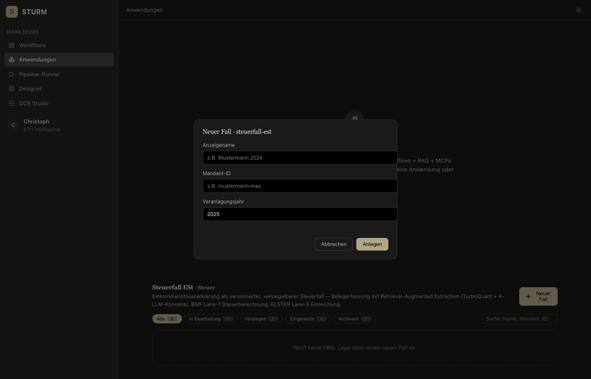
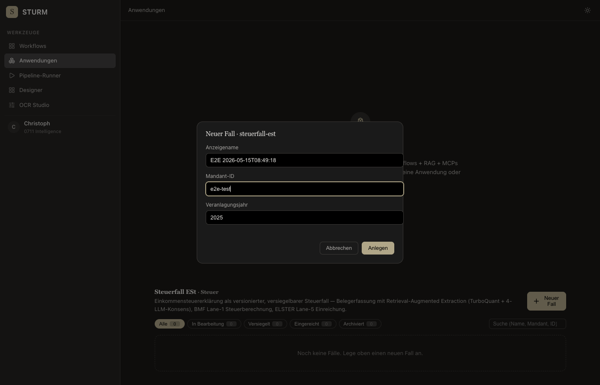
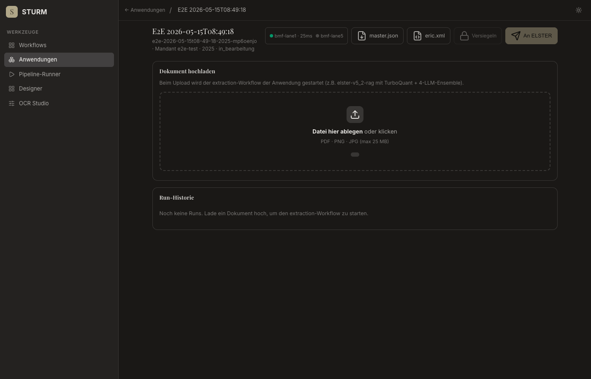
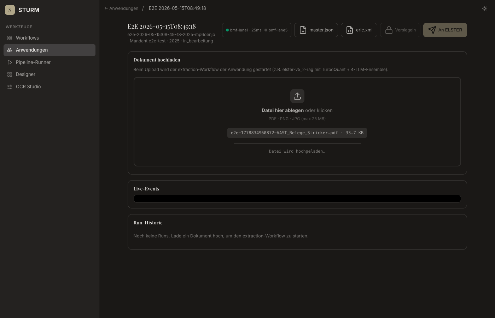
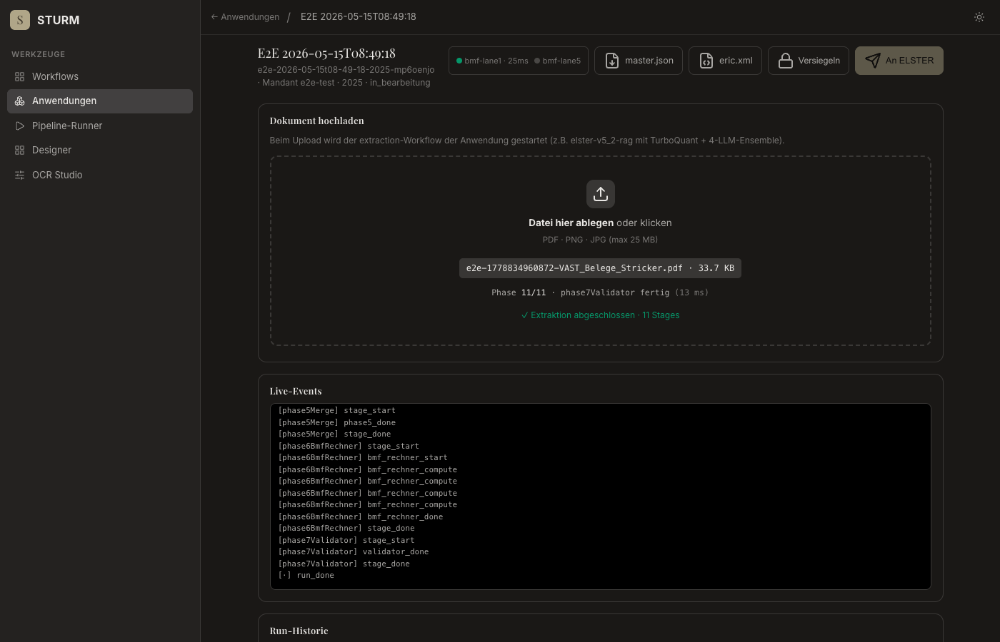
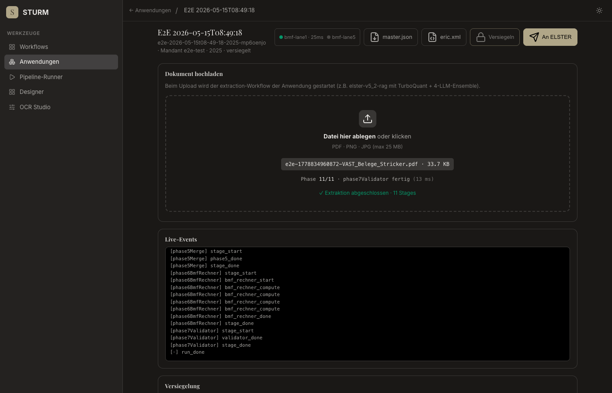
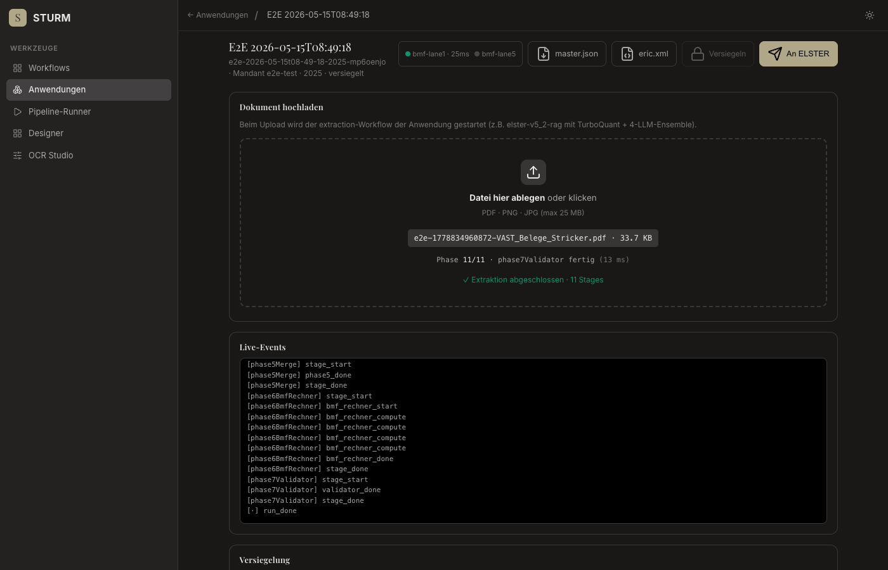

# E2E Anwendungen — Fehlerreport

**Datum:** 2026-05-15T08:49:08.539Z
**Target:** https://sturm.0711.io
**Fixture:** VAST_Belege_Stricker.pdf
**Case-ID:** e2e-2026-05-15t08-49-18-2025-mp6oenjo

## Zusammenfassung

- ✅ OK:   **8**
- ❌ Fail: **0**
- ⏭ Skip: **0**

| # | Schritt | Status | Fehler |
|---|---|---|---|
| 1 | open-anwendungen | ✅ ok |  |
| 2 | open-new-case-modal | ✅ ok |  |
| 3 | create-case | ✅ ok |  |
| 4 | steuerfall-loaded | ✅ ok |  |
| 5 | upload-and-extract | ✅ ok |  |
| 6 | verify-canonical-layer | ✅ ok |  |
| 7 | seal | ✅ ok |  |
| 8 | export | ✅ ok |  |

---

## ✅ Step 1: open-anwendungen
*GET /anwendungen.html*

- **Status:** ok
- **Started:** 2026-05-15T08:49:08.977Z
- **Finished:** 2026-05-15T08:49:18.760Z

### Screenshots

**loaded**



### Log

```
[08:49:18] screenshot → step-01-loaded.png
[08:49:18] App-Sections gerendert: 1
```

---

## ✅ Step 2: open-new-case-modal
*Click "Neuer Fall" button*

- **Status:** ok
- **Started:** 2026-05-15T08:49:18.760Z
- **Finished:** 2026-05-15T08:49:18.832Z

### Screenshots

**modal-open**



### Log

```
[08:49:18] screenshot → step-02-modal-open.png
```

---

## ✅ Step 3: create-case
*Fill modal + submit POST /api/applications/.../instances*

- **Status:** ok
- **Started:** 2026-05-15T08:49:18.832Z
- **Finished:** 2026-05-15T08:49:20.302Z

### Screenshots

**filled**



### Log

```
[08:49:19] screenshot → step-03-filled.png
[08:49:20] POST instances → 201  null
[08:49:20] redirected → https://sturm.0711.io/steuerfall.html?app=steuerfall-est&case=e2e-2026-05-15t08-49-18-2025-mp6oenjo
[08:49:20] caseId fallback aus URL: e2e-2026-05-15t08-49-18-2025-mp6oenjo
```

---

## ✅ Step 4: steuerfall-loaded
*Verify /steuerfall.html rendered with case data*

- **Status:** ok
- **Started:** 2026-05-15T08:49:20.302Z
- **Finished:** 2026-05-15T08:49:20.872Z

### Screenshots

**loaded**



### Log

```
[08:49:20] screenshot → step-04-loaded.png
[08:49:20] case-display: E2E 2026-05-15T08:49:18
[08:49:20] case-meta:    e2e-2026-05-15t08-49-18-2025-mp6oenjo · Mandant e2e-test · 2025 · in_bearbeitung
```

---

## ✅ Step 5: upload-and-extract
*Upload VAST_Belege_Stricker.pdf → SSE*

- **Status:** ok
- **Started:** 2026-05-15T08:49:20.872Z
- **Finished:** 2026-05-15T08:49:33.021Z

### Screenshots

**uploading-start**



**after-upload**


### Log

```
[08:49:20] file selected: /tmp/e2e-1778834960872-VAST_Belege_Stricker.pdf
[08:49:20] screenshot → step-05-uploading-start.png
[08:49:33] screenshot → step-05-after-upload.png
[08:49:33] drop-result: ✓ Extraktion abgeschlossen · 11 Stages
[08:49:33] last events:
[phase3LlmFill] stage_done
[phase4Disambig] stage_start
[phase4Disambig] phase4_start
[phase4Disambig] phase4_done
[phase4Disambig] stage_done
[phase5Merge] stage_start
[phase5Merge] phase5_done
[phase5Merge] stage_done
[phase6BmfRechner] stage_start
[phase6BmfRechner] bmf_rechner_start
[phase6BmfRechner] bmf_rechner_compute
[phase6BmfRechner] bmf_rechner_compute
[phase6BmfRechner] bmf_rechner_compute
[phase6BmfRechner] bmf_rechner_compute
[phase6BmfRechner] bmf_rechner_done
[phase6BmfRechner] stage_done
[phase7Validator] stage_start
[phase7Validator] validator_done
[phase7Validator] stage_done
[·] run_done
```

---

## ✅ Step 6: verify-canonical-layer
*Result table rendered with ≥1 row*

- **Status:** ok
- **Started:** 2026-05-15T08:49:33.021Z
- **Finished:** 2026-05-15T08:49:33.138Z

### Screenshots

**layer**



### Log

```
[08:49:33] screenshot → step-06-layer.png
[08:49:33] layer rows: 9
[08:49:33] layer-sub:  aus Stage: phase6BmfRechner · 20 eCodes · 9 sichtbar nach Dedup · REGEX_3F=16 · BMF_RECHNER=4
[08:49:33] GET /result stats  {"totalFields":20,"byOrigin":{"REGEX_3F":16,"BMF_RECHNER":4}}
```

---

## ✅ Step 7: seal
*Click "Versiegeln" → steuerfall-seal workflow*

- **Status:** ok
- **Started:** 2026-05-15T08:49:33.138Z
- **Finished:** 2026-05-15T08:49:35.845Z

### Screenshots

**after-seal**



### Log

```
[08:49:33] btn-seal disabled? false
[08:49:33] POST /seal → 200
[08:49:35] screenshot → step-07-after-seal.png
[08:49:35] alerts captured  []
[08:49:35] case-meta after seal: e2e-2026-05-15t08-49-18-2025-mp6oenjo · Mandant e2e-test · 2025 · versiegelt
```

---

## ✅ Step 8: export
*Click "An ELSTER" → Lane-5 MCP (Stub erwartet)*

- **Status:** ok
- **Started:** 2026-05-15T08:49:35.845Z
- **Finished:** 2026-05-15T08:49:37.818Z

### Screenshots

**after-export**



### Log

```
[08:49:35] btn-export disabled? false
[08:49:36] POST /export → 503  {"erfolg":false,"reason":"mcp-unavailable"}
[08:49:37] screenshot → step-08-after-export.png
```

---

## Netzwerk-Fehler (Status ≥ 400)

```
[08:49:36] POST https://sturm.0711.io/api/applications/steuerfall-est/instances/e2e-2026-05-15t08-49-18-2025-mp6oenjo/export → 503
  body: {"erfolg":false,"reason":"mcp-unavailable"}
```

## Console (errors + warnings)

```
[08:49:36] ERROR Failed to load resource: the server responded with a status of 503 ()
```